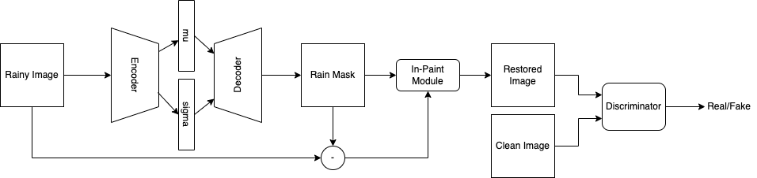
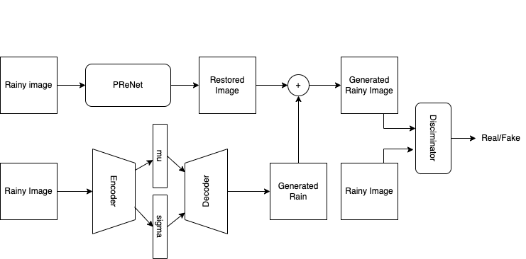
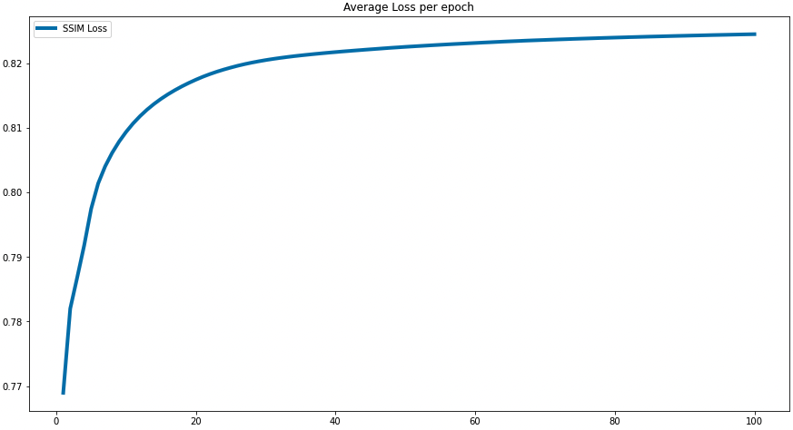
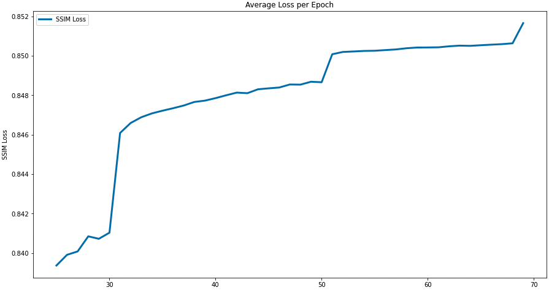
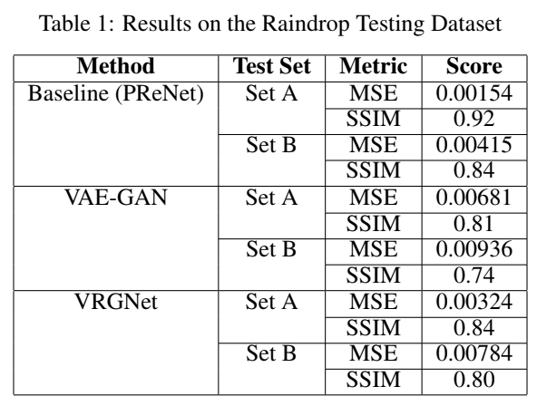
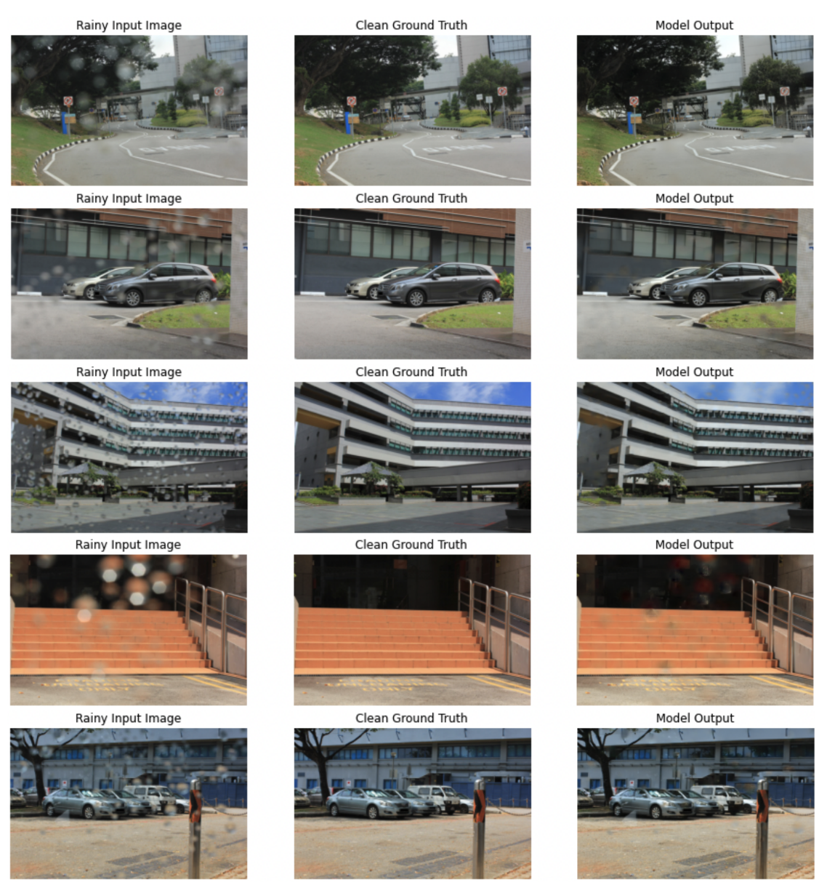
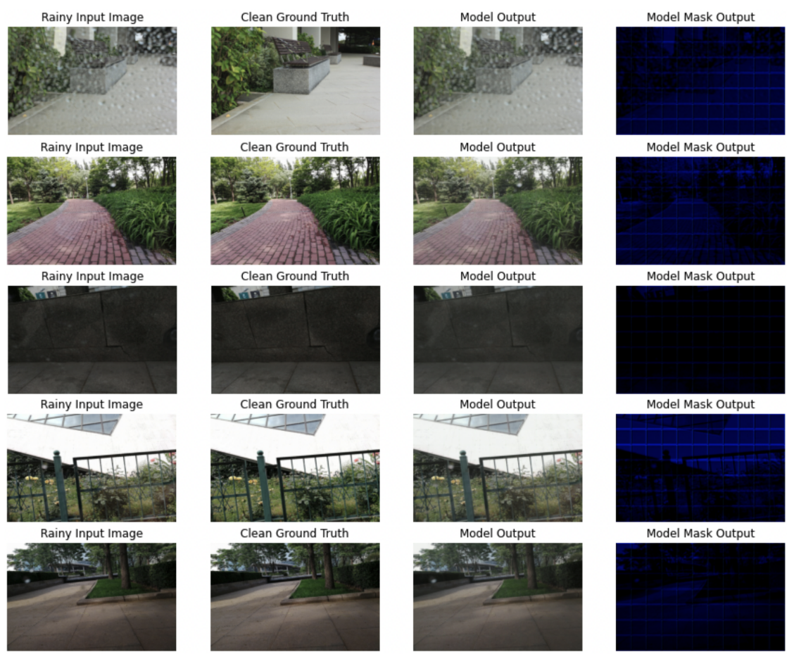
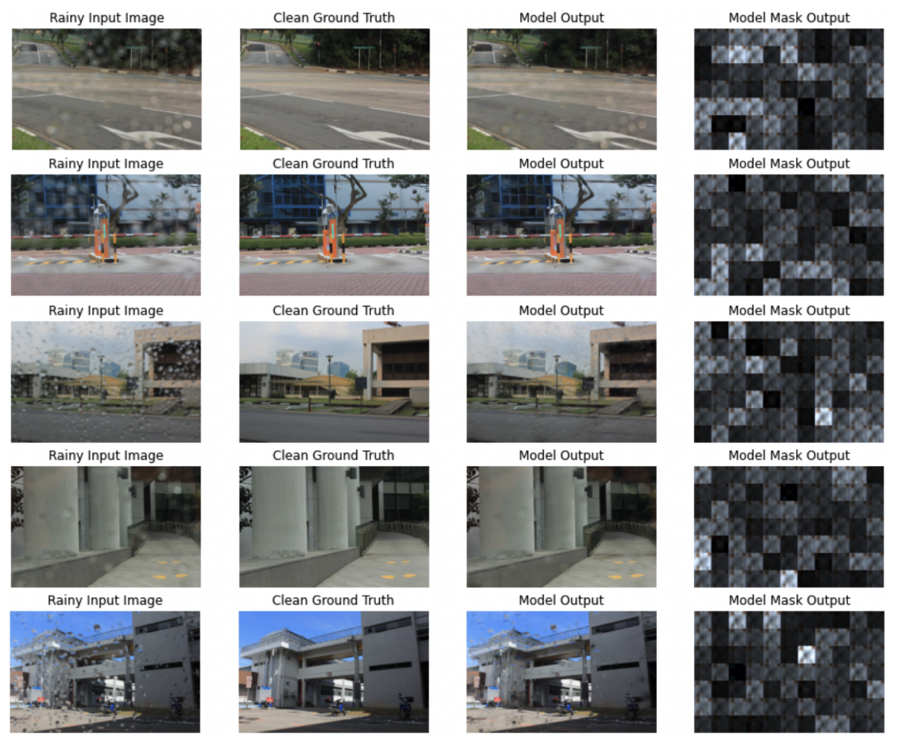

# DeDrop - Raindrop Removal and Generation using Generative Adversarial Network
Rain has a variety of visual impacts. It often causes dramatic fluctuations in the intensity of images and videos, which can seriously impede the performance of outdoor vision systems. Rain affects the general viewing field of all lenses adversely, thus increasing the complexity of modelling exigent Computer Vision focused tasks such as autonomous driving, object tracking, scene segmentation.Additionally, rain obfuscates vision systems in a variety of ways such as rain streaks and droplets possessing varying spatial-luminosity properties. Therefore, it is vital to tackle the problem of rain obstruction in images. The referenced paper provides a method for Single Image Rain Removal (SIRR) using a Generative Adversarial Network (GAN), but the paper only focuses on rainy images with obstructed backgrounds and not on images clicked by obfuscated camera lenses. Through this project, we attempt to explore the removal of raindrops from said images, extending the work of the original paper to de-noise images obstructed by droplets on camera lenses.

# Methods Used
In this project, we have 2 methods for Raindrop removal.
## Proposed Method

## VRGNet for Raindrop Removal

# Training
For plotting the loss we have used the Structural Similarity Index Metric (SSIM).
| Proposed | VRGNet |
| -------- | ------ |
| | |

# Results
## Abalation Study

## Quantative Results
### PRNet Outputs

### VAE-GAN Output (Proposed)

### VRGNet Output
